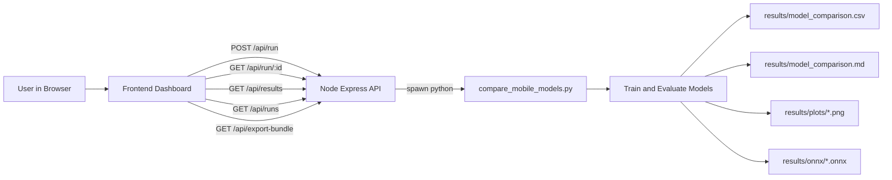
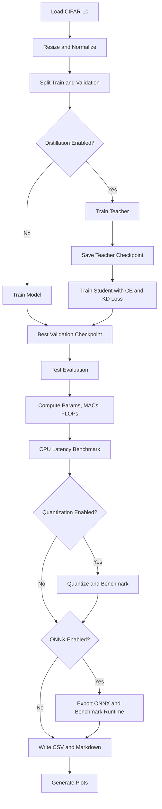
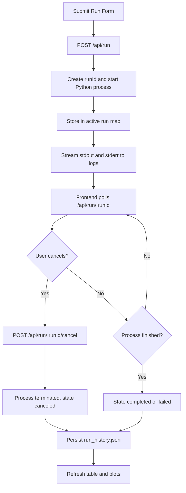

# Mobile-Ready Model Comparison Platform

This project is a complete platform to compare lightweight deep learning models for mobile deployment.

It combines:
- A Python benchmarking and training pipeline
- A Node.js backend API
- A browser dashboard frontend

You can run experiments, monitor logs, compare model metrics, visualize tradeoffs, export artifacts, and manage run history from one interface.

## What This Project Is About

When deploying AI on mobile or edge devices, model selection is not only about accuracy.

You must optimize a tradeoff between:
- Accuracy
- CPU latency
- Model size
- Compute cost

This project helps you evaluate those tradeoffs across three mobile-friendly architectures:
- MobileNetV3-Small
- ShuffleNetV2 x1.0
- EfficientNet-B0

## Main Features

1. Advanced model training and comparison
- Transfer learning from ImageNet pretrained weights
- Label smoothing
- Mixed precision training on CUDA
- Cosine annealing learning rate schedule
- Optional knowledge distillation
- Optional dynamic quantization
- Optional ONNX export and ONNX Runtime benchmark

2. Deployment-focused metrics
- Validation and test accuracy
- Parameter count
- MACs and FLOPs
- FP32 model size and quantized size
- CPU latency and optional ONNX CPU latency

3. Web application experience
- Configure and start runs from browser
- Live logs and run status tracking
- Cancel active runs
- Persistent run history
- One-click export bundle (ZIP)

4. Automatic visualizations
- Accuracy chart
- Latency chart
- Pareto chart (accuracy vs latency)
- Size vs accuracy chart
- Optional quantized and ONNX latency charts

## Tech Stack

1. Training and benchmarking
- Python
- PyTorch and TorchVision
- Pandas
- THOP
- ONNX and ONNX Runtime
- Matplotlib

2. Backend
- Node.js
- Express
- Archiver

3. Frontend
- HTML
- CSS
- Vanilla JavaScript

## Project Structure

- compare_mobile_models.py: model training, evaluation, benchmarking, exports, plots
- server.js: Node API for run control, status, history, and bundle export
- public/index.html: dashboard UI
- public/app.js: frontend logic and API calls
- public/styles.css: responsive styling
- requirements.txt: Python dependencies
- package.json: Node dependencies and scripts
- results/: generated outputs (csv, markdown, plots, onnx, run history)

## End-to-End Architecture



## ML Pipeline Flow



## Run Lifecycle Flow



## Deep Learning Methods Explained

1. Transfer Learning
- The classifier head is replaced for CIFAR-10 classes.
- Backbone features from ImageNet accelerate convergence.

2. Label Smoothing
- Softens hard class targets to reduce overconfidence.
- Improves generalization in many classification settings.

3. Mixed Precision
- Uses lower precision where safe on GPU.
- Benefits: lower memory usage and faster training.

4. Cosine Annealing
- Smooth learning rate decay across epochs.
- Helps stabilize later training stages.

5. Knowledge Distillation
- Teacher model provides soft target distributions.
- Student learns from both true labels and teacher outputs.

Distillation objective:

$$
L = (1 - \alpha) L_{CE} + \alpha T^2 KL\left(softmax\left(\frac{z_s}{T}\right), softmax\left(\frac{z_t}{T}\right)\right)
$$

Where:
- alpha controls hard-target vs soft-target balance
- T is temperature
- z_s and z_t are student and teacher logits

6. Quantization
- Dynamic INT8 quantization is applied to Linear layers.
- Compares speed and size impact with possible accuracy changes.

7. ONNX Deployment Path
- Exports trained models to ONNX format.
- Optional ONNX Runtime benchmark measures deployment-style CPU latency.

## How The Frontend and Backend Work

1. Frontend responsibilities
- Collects run parameters
- Starts run through API
- Polls live run status and logs
- Displays comparison table and generated plots
- Shows run history
- Offers cancel run and export bundle actions

2. Backend responsibilities
- Builds Python CLI arguments from form payload
- Spawns and tracks training process
- Captures logs and process state
- Persists run history
- Serves result files and plots
- Creates ZIP export on demand

## API Endpoints

1. GET /api/health
- Returns service health and Python path.

2. POST /api/run
- Starts a benchmark run.

3. GET /api/run/:runId
- Returns status and logs for a run.

4. POST /api/run/:runId/cancel
- Cancels an active run.

5. GET /api/runs
- Returns active and historical runs.

6. GET /api/results
- Returns parsed table data and plot links.

7. GET /api/export-bundle
- Downloads ZIP containing available artifacts.

## Setup and Run

1. Install Python dependencies

```bash
pip install -r requirements.txt
```

2. Install Node dependencies

```bash
npm install
```

3. Start dashboard server

```bash
npm start
```

4. Open browser

http://localhost:3000

## Output Artifacts

Produced under results/:
- model_comparison.csv
- model_comparison.md
- run_history.json
- plots/*.png
- onnx/*.onnx (if enabled)

## Typical Workflow

1. Open dashboard.
2. Set run configuration.
3. Start run and monitor logs.
4. Inspect table and plots.
5. Compare latency, size, and accuracy tradeoffs.
6. Export artifact bundle for sharing.

## Troubleshooting

1. Python process does not start
- Check .venv exists and dependencies are installed.
- Verify PYTHON_EXECUTABLE if custom path is needed.

2. No results shown
- Ensure run has completed.
- Refresh results or check logs panel for errors.

3. ONNX benchmark missing
- Confirm ONNX and ONNX Runtime are installed.
- Enable ONNX export and ONNX benchmark flags.

## Future Enhancements

1. Per-class metrics and confusion matrix.
2. Hyperparameter sweep presets.
3. Multi-user auth and role-based experiment tracking.
4. Direct mobile device benchmark integration.